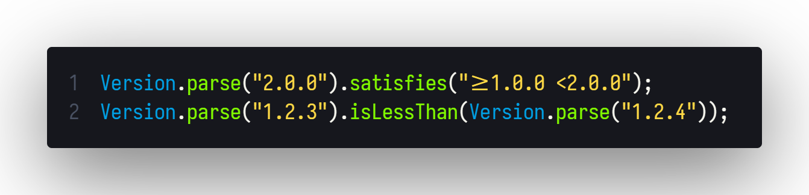

<div align="center">
  <h1>Java-Semver</h1>

  _A modern & lightweight Java library providing full **Semantic Versioning 2.0.0** specification compliance. Designed as a port of the javascript ecosystems [Node Semver](https://github.com/npm/node-semver), it ports all major features of [Node Semver](https://github.com/npm/node-semver) to native Java._

<br>
<div>
<a href="https://github.com/milkdrinkers/Java-Semver/blob/main/LICENSE">
    
</a>
<a href="https://central.sonatype.com/artifact/io.github.milkdrinkers/javasemver">
    
</a>
<a href="https://docs.milkdrinkers.dev/javasemver">
    
</a>
<a href="https://javadoc.io/doc/io.github.milkdrinkers/javasemver">
    
</a>
<br>


<a href="https://github.com/milkdrinkers/Java-Semver/issues">
    
</a>

<a href="https://discord.gg/cG5uWvUcM6">
    
</a>
</div>
</div>

---



## 🌟 Features

- **Full SemVer 2.0.0 Compliance**: Adherence to the official specification.
- **Zero Dependencies**: Lightweight and self-contained.
- **Java 8+ compatible**: Compatible with legacy and modern Java projects.
- **Node Semver Features Ported:**
  - Parsing
  - Comparisons
  - Ranges
  - Incrementing
  - Coercion
- **Well-tested**: Extensive test coverage, including parity tests with node-semver.

## 📦 Installation

Add Java-Semver to your project with **Maven** or **Gradle**:

<details>
<summary>Gradle Kotlin DSL</summary>

```kotlin
repositories {
    mavenCentral()
}

dependencies {
    implementation("io.github.milkdrinkers:javasemver:LATEST_VERSION")
}
```

</details>

<details>
<summary>Maven</summary>

```xml
<project>
    <dependencies>
        <dependency>
            <groupId>io.github.milkdrinkers</groupId>
            <artifactId>javasemver</artifactId>
            <version>LATEST_VERSION</version>
        </dependency>
    </dependencies>
</project>
```

</details>

## Usage Example

```java
import io.github.milkdrinkers.javasemver.Version;
import io.github.milkdrinkers.javasemver.enums.ReleaseType;

// Parsing and comparisons
final Version current = Version.parse("1.0.0-rc.1+5");
final Version latest = Version.parse("2.0.0-beta+exp.sha.5114f85");

current.isLessThan(latest); // true
current.isGreaterThan(latest); // false
current.isEqualTo(latest); // false

// Ranges
Version.parse("1.2.3").satisfies("^1.0.0");         // true
Version.parse("2.0.0").satisfies(">=1.0.0 <2.0.0"); // false

// Incrementing
Version.parse("1.2.3").increment(ReleaseType.MINOR); // 1.3.0
Version.parse("1.2.3").nextPatch(); // 1.2.4

// Coerceion
Version.coerce("release-v1.2");  // Optional wrapped 1.2.0
```

## 📚 Documentation

- [Full Javadoc Documentation](https://javadoc.io/doc/io.github.milkdrinkers/javasemver)
- [Documentation](https://docs.milkdrinkers.dev/javasemver)
- [Maven Central](https://central.sonatype.com/artifact/io.github.milkdrinkers/javasemver)

---

## 🔨 Building from Source

```bash
git clone https://github.com/milkdrinkers/Java-Semver.git
cd javasemver
./gradlew publishToMavenLocal
```

---

## 🔧 Contributing

Contributions are always welcome! Please make sure to read our [Contributor's Guide](CONTRIBUTING.md) for standards and our [Contributor License Agreement (CLA)](CONTRIBUTOR_LICENSE_AGREEMENT.md) before submitting any pull requests.

We also ask that you adhere to our [Contributor Code of Conduct](CODE_OF_CONDUCT.md) to ensure this community remains a place where all feel welcome to participate.

---

## 📝 Licensing

You can find the license the source code and all assets are under [here](../LICENSE). Additionally, contributors agree to the Contributor License Agreement \(_CLA_\) found [here](CONTRIBUTOR_LICENSE_AGREEMENT.md).

---

## 🔥 Consuming Projects

Here is a list of known projects using Java-Semver:

- [Minecraft-Plugin-Template](https://github.com/milkdrinkers/Minecraft-Plugin-Template) - _Provided by default in a Minecraft Plugin Template._
- [VersionWatch](https://github.com/milkdrinkers/VersionWatch) - _A lightweight library that simplifies version monitoring across popular software distribution platforms.._
- [Maquillage](https://github.com/milkdrinkers/Maquillage) - _Maquillage a Minecraft cosmetics plugin._
- [Stewards](https://github.com/milkdrinkers/Stewards) - _Stewards a Minecraft Towny NPC extension plugin._
- [CharacterCards](https://github.com/Alathra/CharacterCards) - _CharacterCards is a Minecraft plugin allowing players to create cards describing their character._
- (_Add your project here!_)
